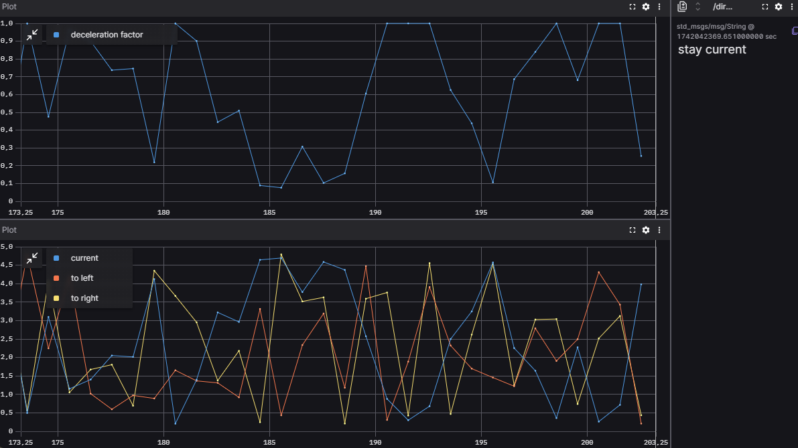

# `sam_zb2` package
ROS 2 C++ package.  [](https://docs.ros.org/en/humble/)
## Projektleírás / Project description
A projekt egy autonóm jármű távolság érzékelő szenzorának szimulált adatait dolgozza fel és ezen adatok alapján bizonyos  mértékű lassítást határoz meg. Emellett a jelenlegi pozíció alapján a 3 érzékelt útvonal (jobb, jelenlegi, bal) közül optimálisat választ.

A package két node-ból áll. A `sensor_pub` node véletlenszerűen generált távolságadatokat publikál (jelenlegi pozíciótól előre, balra előre és jobbra előre mért távolság) egy `std_msgs/float32_multi_array` topicra. A `processor_sub` node erről a topicról kiolvassa a hírdetett adatokat és a jelenlegi pozíciótól előre mért távolságadat alapján lassítási mértéket határoz meg, illetve a 3 közül a legnagyobb adott pillanatban mért távolság alapján új útvonalat választ. Ezeket az értékeket egy `std_msgs/float32` és egy `std_msgs/String` topic-ban hírdeti. 
##
The project processes simulated data from the distance sensor of an autonomous vehicle and determines a certain degree of deceleration based on this data. Additionally, based on the current position, it selects the optimal route among the three detected paths (right, current, left).

The package consists of two nodes. The `sensor_pub` node generates random distance data (measured distances forward from the current position, forward to the left, and forward to the right) and publishes them to a topic of type `std_msgs/Float32MultiArray`. The `processor_sub` node subscribes to this topic, reads the published data, and determines the required level of deceleration based on the forward-measured distance from the current position. Additionally, it selects a new route based on the largest measured distance among the three available paths. These values are then published on topics of type `std_msgs/Float32` and `std_msgs/String`.

## Packages and build

It is assumed that the workspace is `~/ros2_ws/`.

### Clone the packages
``` r
cd ~/ros2_ws/src
```
``` r
git clone https://github.com/Samuferi/sam_zb2
```

### Build ROS 2 packages
``` r
cd ~/ros2_ws
```
``` r
colcon build --packages-select sam_zb2 --symlink-install
```

<details>
<summary> Don't forget to source before ROS commands.</summary>

``` bash
source ~/ros2_ws/install/setup.bash
```
</details>

### Launch of the simulation
``` r
ros2 launch sam_zb2 in_out.launch.py
```
<details>
<summary> You can run the nodes separately from different terminals</summary>

``` bash
ros2 run sam_zb2 sensor_pub 
```
``` bash
ros2 run sam_zb2 processor_sub
```
</details>

### Foxglove launch

``` r
ros2 launch sam_zb2 foxg.launch.py
```


## Graph


## Foxglove plot

